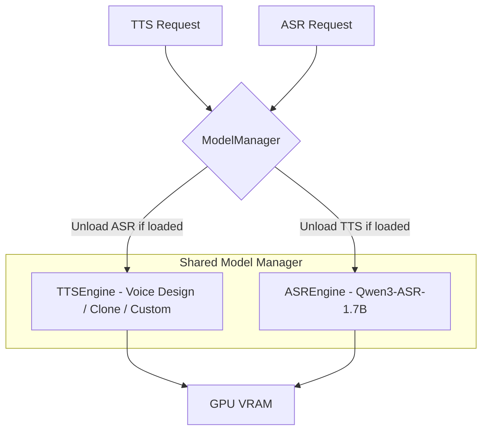

# ASR (Automatic Speech Recognition) Feature

## Overview
Add Qwen3-ASR speech-to-text transcription endpoints to the existing `qwen_tts_service`. The feature provides two synchronous endpoints and integrates with the existing async queue. The ASR model **natively supports GPU batch inference**, meaning a list of audio files can be transcribed in a single GPU forward pass — this is the primary efficiency lever.

## Key Research Finding: GPU Batch Processing ✅
The `qwen-asr` library (`Qwen3ASRModel`) **natively supports batch inference on GPU**:
- `model.transcribe(audio=[file1, file2, ...])` processes all files in **one GPU call**.
- The `max_inference_batch_size` parameter (set at model load time) controls how many items are processed simultaneously. Default: 32.
- Audio inputs can be: local file paths, URLs, base64, or `(np.ndarray, sr)` tuples.
- FlashAttention2 is recommended for reduced VRAM consumption and faster inference (already installed in the Dockerfile).
- The model returns a list of result objects, each with `.text`, `.language`, and optionally `.time_stamps`.

## Architecture

### VRAM Co-existence with TTS
The `TTSEngine` singleton uses a **Single Active Model policy** — it unloads one model family before loading another. The ASR engine will follow the same principle:
- The `ASREngine` is a **separate singleton** (like `TTSEngine`).
- On first ASR request, it loads the `Qwen3-ASR-1.7B` model.
- **Critical**: Before loading ASR, TTSEngine's active model must be offloaded. Before loading any TTS model, ASREngine must offload. This is coordinated via a shared `ModelManager` that wraps both engines.
- This prevents OOM on the RTX A4000 (16GB VRAM) since both models (~3-4GB each in bf16) cannot reliably coexist.



### Model Storage
- **Shared Volume**: ASR model stored at `/app/models/Qwen3-ASR/Qwen3-ASR-1.7B` (mapped from `./storage/models/Qwen3-ASR/`) following the pattern of the TTS models.
- **Lazy Download**: If not present locally, downloaded from HuggingFace on first request (same lazy-loading philosophy as TTS).

## Endpoints

### 1. `POST /api/v1/transcribe` — Batch Transcription
Accepts a list of audio files (by `file_id` from the file registry or direct path) and returns the transcript for each.

**Request** (`ASRBatchRequest`):
```json
{
  "files": [
    { "file_id": "uuid-1", "custom_id": "track_A" },
    { "file_id": "uuid-2", "custom_id": "track_B" }
  ],
  "language": "auto",
  "return_timestamps": false
}
```
- `files`: List of objects, each containing `file_id` (from `/api/v1/files/upload`) and an optional `custom_id` for caller tracking.
- `language`: Optional language hint (uses the existing `LanguageEnum`, maps to ASR model language names). Default: `"auto"`.
- `return_timestamps`: Whether to return word-level timestamps (requires ForcedAligner model to be loaded).

**Response** (`ASRBatchResponse`):
```json
{
  "items": [
    {
      "custom_id": "track_A",
      "text": "Hello world, this is a test.",
      "language": "English",
      "timestamps": null
    },
    {
      "custom_id": "track_B",
      "text": "Bonjour le monde.",
      "language": "French",
      "timestamps": null
    }
  ],
  "performance": 1.234
}
```

**GPU Efficiency**: All files in `files` are passed as a single list to `model.transcribe(audio=[...])`, processed in one GPU batch. If the batch exceeds `max_inference_batch_size`, the `qwen-asr` library handles internal chunking automatically.

### 2. `POST /api/v1/transcribe/file` — Single File Transcription (Upload)
Convenience endpoint for transcribing a single uploaded audio file directly (multipart form).

**Request** (multipart/form-data):
- `audio`: The audio file (UploadFile)
- `language`: Optional language hint (default: `"auto"`)
- `return_timestamps`: Optional boolean (default: `false`)

**Response** (`ASRSingleResponse`):
```json
{
  "text": "Hello world, this is a test.",
  "language": "English",
  "timestamps": null,
  "performance": 0.456
}
```

### 3. Queue Integration — `operation: "transcribe"`
The existing async queue (`POST /api/v1/queue/submit`) supports a new operation type: `"transcribe"`. The `GPUWorker` handles it like TTS operations but calls the `ASREngine` instead.

**Queue Item Payload**:
```json
{
  "text": "",
  "operation": "transcribe",
  "ref_audio": "file-id-or-path",
  "language": "auto",
  "custom_id": "user-tracking-id"
}
```
- The `text` field is unused for ASR but kept for schema compatibility.
- Result: The `url` field in `QueueItemStatus` points to a JSON file containing the transcript instead of a WAV file.

## File Structure (New / Modified Files)

```
qwen_tts_service/app/
├── services/
│   ├── asr_engine.py          ← NEW: ASREngine singleton (model load/unload, transcribe)
│   ├── model_manager.py       ← NEW: Coordinates VRAM between TTSEngine & ASREngine
│   ├── tts_engine.py          ← MODIFIED: Add acquire/release hooks for ModelManager
│   ├── gpu_worker.py          ← MODIFIED: Add "transcribe" operation branch
│   └── ...
├── models/
│   ├── requests.py            ← MODIFIED: Add ASR language mappings (superset of TTS langs)
│   ├── asr_models.py          ← NEW: ASRBatchRequest, ASRFileItem, ASRBatchResponse, etc.
│   └── queue_models.py        ← MODIFIED: Add "transcribe" to operation Literal type
├── api/v1/endpoints/
│   ├── asr.py                 ← NEW: /transcribe and /transcribe/file endpoints
│   └── ...
├── core/
│   └── config.py              ← MODIFIED: Add ASR config (ASR_MODEL_ROOT, ASR_MAX_BATCH_SIZE)
└── main.py                    ← MODIFIED: Register ASR router
```

**Other files:**
- `qwen_tts_service/requirements.txt` ← Add `qwen-asr`
- `docker-compose.yaml` ← Add ASR model volume mount
- `scripts/download_asr.py` ← Modify target path to match new shared volume layout

## Implementation Steps (Ordered)

### Phase 1: Infrastructure
1. **`requirements.txt`** — Add `qwen-asr` dependency.
2. **`config.py`** — Add `ASR_MODEL_ROOT`, `ENABLE_ASR`, `ASR_MAX_BATCH_SIZE` settings.
3. **`docker-compose.yaml`** — Add volume mount for ASR model (`./storage/models/Qwen3-ASR:/app/models/Qwen3-ASR`). Already covered by existing `./storage/models:/app/models` mount.
4. **`scripts/download_asr.py`** — Update target path to `/app/models/Qwen3-ASR/Qwen3-ASR-1.7B` (consistent with container mount). Or create a separate download script.

### Phase 2: Engine Layer
5. **`model_manager.py`** — Create a `ModelManager` singleton that:
   - Tracks which engine ("tts" or "asr") currently holds GPU.
   - Exposes `acquire(engine_type)` which unloads the other engine before returning.
   - Thread-safe (uses `threading.Lock`).
6. **`asr_engine.py`** — Create `ASREngine` singleton:
   - `_load_model()`: Loads `Qwen3ASRModel.from_pretrained(...)` with `bf16`, `flash_attention_2`, `max_inference_batch_size=ASR_MAX_BATCH_SIZE`.
   - `_unload_model()`: Deletes model, runs `gc.collect()` + `torch.cuda.empty_cache()`.
   - `transcribe(audio_paths, language, return_timestamps)`: Calls `model.transcribe()` with the batch of paths.
   - Uses `ModelManager.acquire("asr")` before loading.
7. **`tts_engine.py`** — Modify `_get_model()` to call `ModelManager.acquire("tts")` before loading, and add `_unload_all_models()` as a public interface for the manager.

### Phase 3: API Layer
8. **`asr_models.py`** — Define Pydantic models:
   - `ASRFileItem(file_id: str, custom_id: Optional[str])`
   - `ASRBatchRequest(files: List[ASRFileItem], language, return_timestamps)`
   - `ASRTranscriptItem(custom_id, text, language, timestamps)`
   - `ASRBatchResponse(items: List[ASRTranscriptItem], performance: float)`
   - `ASRSingleResponse(text, language, timestamps, performance)`
9. **`asr.py`** — Implement two endpoints:
   - `POST /transcribe`: Resolves `file_id` list → paths, calls `asr_engine.transcribe()`, maps results.
   - `POST /transcribe/file`: Receives `UploadFile`, saves to temp, calls `asr_engine.transcribe()` for single file.
10. **`main.py`** — Register the ASR router under `/api/v1` with tag `"ASR"`.

### Phase 4: Queue Integration
11. **`queue_models.py`** — Add `"transcribe"` to the `operation` Literal type.
12. **`gpu_worker.py`** — Add `elif operation == "transcribe":` branch that:
    - Extracts `ref_audio` paths from items.
    - Calls `asr_engine.transcribe()` with the batch.
    - Saves transcript as JSON to file store.
    - Marks items as done with the JSON download URL.

### Phase 5: Documentation & Cleanup
13. **`Logic/asr_feature.md`** — This file (already created).
14. **Update `README.md`** with ASR endpoint documentation.

## ASR-Specific Language Mapping
The ASR model supports a larger set of languages than TTS. The `LanguageEnum` can be extended, or the ASR endpoints can accept raw strings directly. The ComfyUI node shows the full list:
`auto, Chinese, English, Cantonese, Arabic, German, French, Spanish, Portuguese, Indonesian, Italian, Korean, Russian, Thai, Vietnamese, Japanese, Turkish, Hindi, Malay, Dutch, Swedish, Danish, Finnish, Polish, Czech, Filipino, Persian, Greek, Hungarian, Macedonian, Romanian`

For the API, we keep the existing `LanguageEnum` for the subset used in TTS, and add a separate `ASRLanguageEnum` that covers the full set. The `language` field on ASR endpoints uses `ASRLanguageEnum` with a default of `"auto"`.

## Tuning Constants (Top of files)

### `asr_engine.py`
```python
ASR_MODEL_ID = "Qwen/Qwen3-ASR-1.7B"
ASR_LOCAL_DIR = "Qwen3-ASR-1.7B"
ASR_DTYPE = torch.bfloat16
ASR_ATTN_IMPL = "flash_attention_2"
ASR_MAX_BATCH_SIZE = 32
ASR_MAX_NEW_TOKENS = 256
```

### `model_manager.py`
```python
# No tuning constants — purely coordination logic
```

## Performance Characteristics
- **Single file latency**: ~0.3-0.5s for a 10s audio clip (GPU, bf16, flash_attn2).
- **Batch throughput**: Near-linear scaling up to `max_inference_batch_size`. 8 files ≈ 1.2× the time of 1 file.
- **Model swap overhead**: ~3-5s to unload TTS + load ASR (one-time cost on first ASR request after TTS usage).
- **VRAM**: ~3-4GB for the 1.7B model in bf16.
