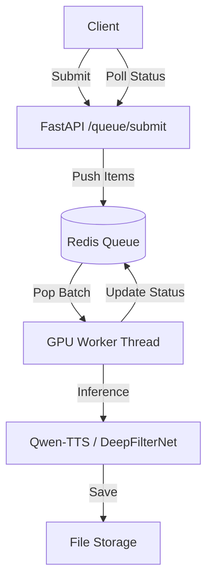

# Async Batch Queue Feature

## Overview
The Async Batch Queue allows clients to submit large volumes of TTS requests without blocking. It uses Redis as a task broker and follows the **Continuous Batching** pattern for maximum GPU efficiency.

## Architecture

## Continuous Batching Logic
The GPU Worker pulls up to `QUEUE_MAX_BATCH_SIZE` items from the Redis list `gpu_queue`.
To optimize VRAM and avoid constant model swapping, the worker:
1. Groups pulled items by their `operation` (e.g., `voice_clone`, `voice_design`).
2. Processes the largest group in one GPU call.
3. Pushes items from the remaining (smaller) groups back to the head of the queue.

## Redis Key Schema

| Key | Type | Description |
|---|---|---|
| `gpu_queue` | List | JSON strings of pending task payloads |
| `batch:{id}` | Hash | Metadata: total, completed, failed, status, label |
| `batch_items:{id}` | List | List of all item IDs belonging to the batch |
| `item:{id}` | Hash | Result data: status, url, error, custom_id, payload |

## Endpoints

- `POST /api/v1/queue/submit`
- `GET /api/v1/queue/status/{batch_id}`
- `GET /api/v1/queue/results/{batch_id}`

## Configuration (ENV)
- `REDIS_URL`: Connection string (default: `redis://redis:6379/0`)
- `QUEUE_MAX_BATCH_SIZE`: Items per GPU batch (default: 8)
- `QUEUE_POLL_INTERVAL`: Worker idle sleep (default: 0.1s)
