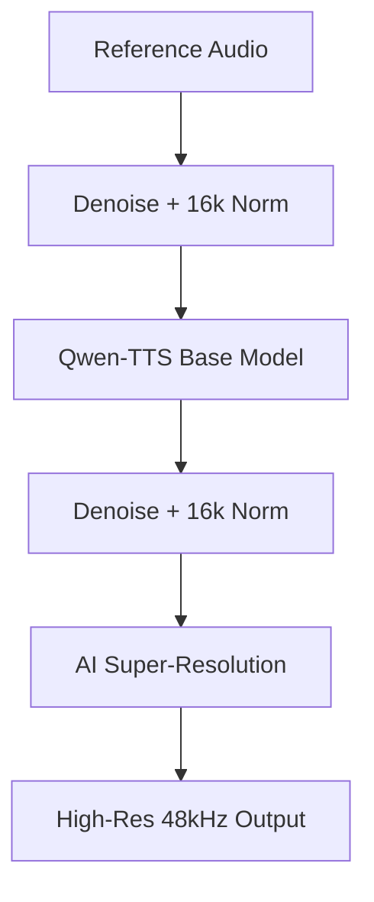

# Audio Pre/Post-Processing Pipeline

## Overview
The enhanced voice cloning pipeline provides high-quality audio output by wrapping the core TTS engine with professional-grade resampling and noise removal stages.

## Pipeline Flow
The pipeline follows a 5-stage orchestration:

1.  **Stage 1 (Pre)**: Denoises reference audio and normalizes to 16kHz using the **Facebook Denoiser**.
2.  **Stage 2 (TTS)**: Uses the clean 16kHz reference for voice cloning.
3.  **Stage 3 (Post)**: 
    - Applies a final denoising pass to the generated 16kHz output on the GPU.
    - Performance **AI Super-Resolution** (Stage 4) using **NoVaSR** to upscale to 48kHz for high-fidelity delivery.

## Key Services

### Denoiser Service (`fb_denoiser.py`)
- **Facebook Denoiser (DNS48)**: High-performance 16kHz speech enhancement.
- **Unified Normalization**: Replaces the legacy resampler by internalizing 16kHz conversion.
- **Batched GPU Processing**: Denoises TTS output batches directly in VRAM.

### Super-Resolution Service (`super_res.py`)
- **NoVaSR (AI Super-Resolution)**: Ultra-lightweight model that upscales from 16kHz to 48kHz.
- **Batched GPU Processing**: Upscales TTS outputs directly on the GPU for maximum speed.

### Orchestrator (`audio_pipeline.py`)
- **Zero-Copy Flow**: Keeps generated audio as Tensors/Memory-Bytes during the entire post-processing chain (Denoise -> Upsample).
- **Latency Optimization**: Elimination of disk I/O between post-stages.
- **Tuning**: Toggle `RUN_PRE_PROCESSING`, `RUN_POST_PROCESSING`, and `RUN_UPSAMPLING` directly in the file.

## Tuning & Configuration
The pipeline behavior can be adjusted in `audio_pipeline.py` using these constants:
- `RUN_PRE_PROCESSING`: Enables/Disables Denoise & 16k Normalization of Reference Audio.
- `RUN_POST_PROCESSING`: Enables/Disables Denoise & 16k Normalization of TTS Output.
- `RUN_UPSAMPLING`: Enables/Disables 48kHz Super-Resolution (Post-only).

## API Endpoint
`POST /api/v1/voice-clone-enhanced`

Accepts a `VoiceCloneEnhancedRequest` which is compatible with the standard `VoiceCloneRequest`. It returns a mapping of result audios, having processed them through the full enhancement chain.

## Scalability
The system is built for high throughput:
- **Batch Processing**: All stages operate on lists of files.
- **Parallel Workers**: Configurable concurrency in both resampling and denoising.
- **VRAM Management**: DeepFilterNet and TTS models are coordinated to prevent OOM errors.
