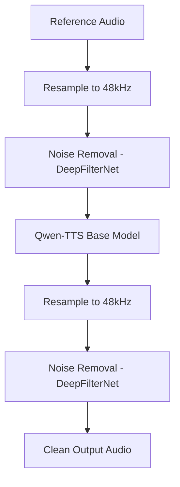

# Audio Pre/Post-Processing Pipeline

## Overview
The enhanced voice cloning pipeline provides high-quality audio output by wrapping the core TTS engine with professional-grade resampling and noise removal stages.

## Pipeline Flow
The pipeline follows a 5-stage orchestration:

1.  **Resample (Stage 1)**: Normalizes input audio to 48kHz using a high-quality cascade (`soxr` -> `scipy` -> `torchaudio`).
2.  **Noise Removal (Stage 2)**: Removes background noise from the reference using **DeepFilterNet3**.
3.  **TTS Generation (Stage 3)**: Uses the cleaned reference for superior voice cloning results.
4.  **Resample (Stage 4)**: Normalizes the generated audio back to 48kHz.
5.  **Noise Removal (Stage 5)**: Applies a final polish to the generated audio to remove any synthetic artifacts or noise.

## Key Services

### Resampler Service (`resampler.py`)
- **HQ Cascade**: Uses `soxr` for top-tier resampling quality.
- **Parallelism**: Processes batches via `ThreadPoolExecutor` with configurable `max_workers` (default: 3).
- **Efficiency**: Only resamples if the source rate differs from the target.

### Noise Removal Service (`noise_removal.py`)
- **DeepFilterNet**: State-of-the-art noise suppression.
- **VRAM Optimized**: Model is lazy-loaded and shared across requests (singleton).
- **Parallelism**: Concurrent denoising of batch items.

### Orchestrator (`audio_pipeline.py`)
- **Per-File Parallelism**: Processes CPU-bound pre/post stages (1, 2, 4, 5) concurrently for each file in a batch.
- **Batched GPU TTS**: Synchronizes items at Stage 3 to maximize GPU utilization via batch inference.
- **Latency Optimization**: Prevents slow files from blocking faster files at stage boundaries.
- **Cleanup**: Manages temporary file lifecycle across the parallel chains.
- **Tuning**: Contains internal flags (`RUN_PRE_PROCESSING`, `RUN_POST_PROCESSING`) to bypass stages for performance testing or custom workflows.

## Tuning & Configuration
The pipeline behavior can be adjusted in `audio_pipeline.py` using these constants:
- `RUN_PRE_PROCESSING`: Enables/Disables Stage 1 (Resample) and Stage 2 (Denoise) *before* TTS generation.
- `RUN_POST_PROCESSING`: Enables/Disables Stage 4 (Resample) and Stage 5 (Denoise) *after* TTS generation.

## API Endpoint
`POST /api/v1/voice-clone-enhanced`

Accepts a `VoiceCloneEnhancedRequest` which is compatible with the standard `VoiceCloneRequest`. It returns a mapping of result audios, having processed them through the full enhancement chain.

## Scalability
The system is built for high throughput:
- **Batch Processing**: All stages operate on lists of files.
- **Parallel Workers**: Configurable concurrency in both resampling and denoising.
- **VRAM Management**: DeepFilterNet and TTS models are coordinated to prevent OOM errors.
